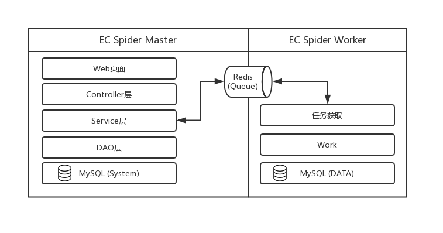
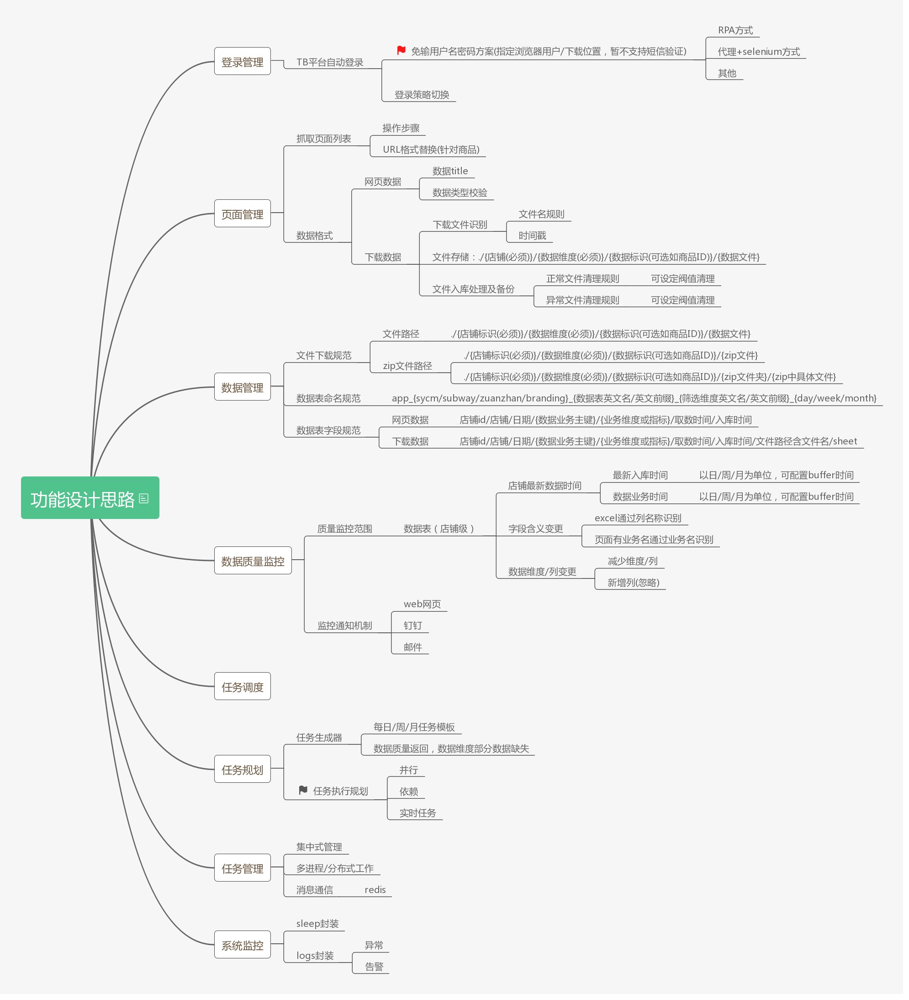

# EC_Spider
针对电商行业取数系统。
- 支持SYCM/ZTC/ZUANZHAN/BRANDING/JDSZ等系统。
- 支持离线及实时业务场景
- 支持分布式及并发抓取
- 后续会支持web端进行管理

## 一、整体架构说明
架构为主从架构，以Master管理Worker，Worker为工作实例/取数进程。
消息队列使用redis，系统数据库为Mysql，取数结果支持存放文件、Mysql等其他数据库。

## 二、文件目录结构说明
- Master.py：管理端启动
- Worker.py：工作端启动
- controller/：web前端与后端交付
- service/：service层 业务对象接口层
- dao/：dao层 数据库对象接口层
- handle/：worker工作实例实现
- init_scripts/：初始化脚本存放
- docs/：文档存放

## 其他

